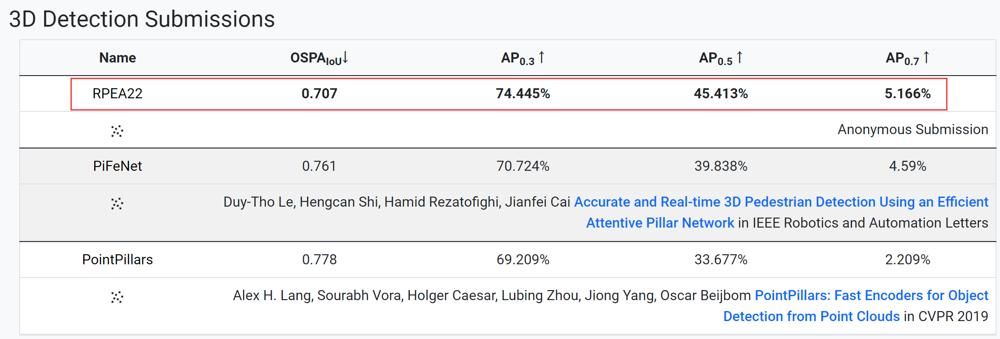
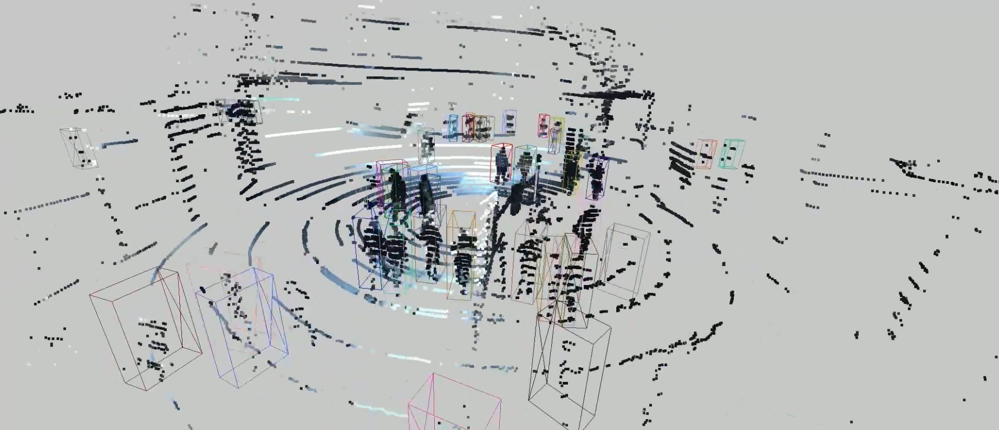

# RPEA

Official PyTorch implementation of RPEA: A Residual Path Network with Efficient Attention for 3D Pedestrian Detection from LiDAR Point Clouds.
[[Paper]](https://doi.org/10.1016/j.eswa.2024.123497)

## News

- **(2024-03-23)** 🔥 We release the code of RPEA.
- **(2024-02-15)** RPEA is accepted by Expert Systems With Applications 2024.
- **(2023-07-04)** 🏆 RPEA ranks first on [JRDB 2022 3D Pedestrian Detection Leaderboard](https://jrdb.erc.monash.edu/leaderboards/detection22).
- **(2023-07-04)** 🏆 RPEA ranks first on [JRDB 2019 3D Pedestrian Detection Leaderboard](https://jrdb.erc.monash.edu/leaderboards/detection).



## 3D Pedestrian Detection Results

### JRDB Leaderboard (validation set)

|            Model             | AP@0.3  | AP@0.5  | AP@0.7 |                                             Checkpoint                                              |
|:----------------------------:|:-------:|:-------:|:------:|:---------------------------------------------------------------------------------------------------:|
| [JRDB 2022](bin/jrdb22.yaml) | 72.554% | 42.758% | 5.047% | [RPEA_JRDB2022.pth](https://github.com/jinzhengguang/RPEA/releases/download/v1.0/RPEA_JRDB2022.pth) |
| [JRDB 2019](bin/jrdb19.yaml) | 73.486% | 43.409% | 5.773% | [RPEA_JRDB2019.pth](https://github.com/jinzhengguang/RPEA/releases/download/v1.0/RPEA_JRDB2019.pth) |


### JRDB Leaderboard

|            Model             | OSPA@IoU | AP@0.3 | AP@0.5  | AP@0.7 | 
|:----------------------------:|:--------:|:------:|:-------:|:------:|
| [JRDB 2022](bin/jrdb22.yaml) |  0.707   |74.445% | 45.413% | 5.166% |
| [JRDB 2019](bin/jrdb19.yaml) | 0.572    |76.905% | 46.076% | 5.296% |


## Requirements

- `python==3.9`
- `PyTorch==1.13.1`
- `cuda==11.6`
- `torchsparse==1.2.0` [(link)](https://github.com/mit-han-lab/torchsparse)

```shell
python setup.py develop
cd lib/iou3d
python setup.py develop
cd ../jrdb_det3d_eval
python setup.py develop
```


## JRDB dataset

Download [JRDB dataset](https://jrdb.erc.monash.edu/) under `PROJECT/data`.

```
python train.py [--evaluation] --cfg PATH_TO_CFG [--ckpt PATH_TO_CKPT]
```

```shell
#convert_labels_to_KITTI
python lib/jrdb_devkit/detection_eval/convert_labels_to_KITTI.py
#train
python train.py --cfg ./jrdb19.yaml
#validation
python train.py --cfg ./jrdb19.yaml --evaluation --ckpt ckpt_e40_train.pth
```

## Visualize the predicted results.




## Citation
```
@article{guang2024rpea,
  title={RPEA: A Residual Path Network with Efficient Attention for 3D pedestrian detection from LiDAR point clouds},
  author={Guang, Jinzheng and Hu, Zhengxi and Wu, Shichao and Zhang, Qianyi and Liu, Jingtai},
  journal={Expert Systems with Applications},
  volume = {249},
  pages={123497},
  year={2024},
  publisher={Elsevier}
}
```

## Acknowledgement

- Person_MinkUNet [(link)](https://github.com/VisualComputingInstitute/Person_MinkUNet)
- PiFeNet [(link)](https://github.com/ldtho/PiFeNet)
- torchsparse [(link)](https://github.com/mit-han-lab/torchsparse)
- PointRCNN [(link)](https://github.com/sshaoshuai/PointRCNN)

## Contact Information

If you have any suggestion or question, you can leave a message here or contact us directly: guangjinzheng@qq.com. Thanks for your attention!

