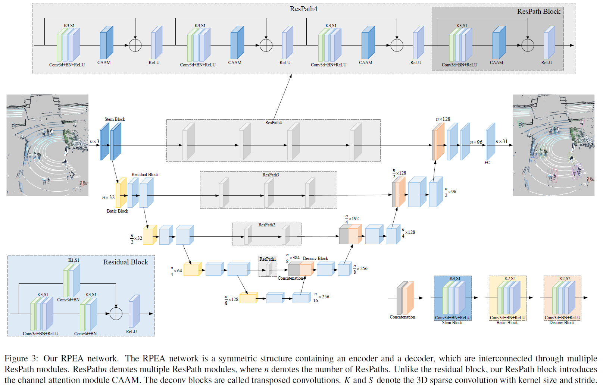
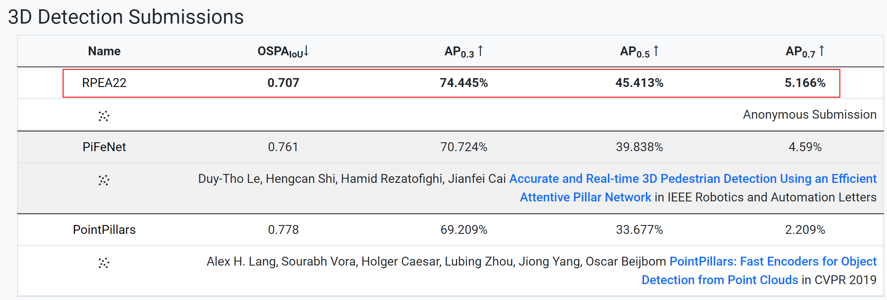
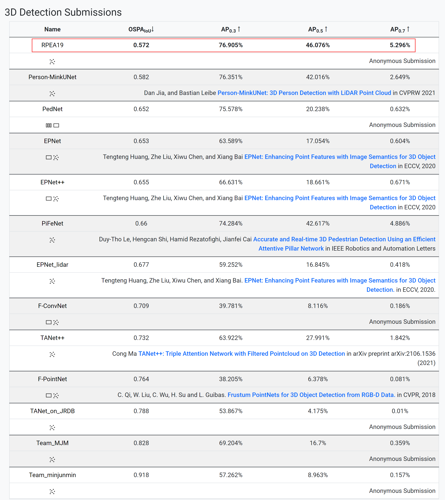

# RPEA (PyTorch)

Official implementation of RPEA. 
Our RPEA ranks first on [JRDB 2019](https://jrdb.erc.monash.edu/leaderboards/detection)
 and [JRDB 2022](https://jrdb.erc.monash.edu/leaderboards/detection22)
 3D pedestrian detection
leaderboards.


## Our RPEA network



## 3D Detection Leaderboards (2023-07-27)

[JRDB 2022 Leaderboard](https://jrdb.erc.monash.edu/leaderboards/detection22)

```
             AP@0.3      AP@0.5      AP@0.7
RPEA         74.445%	 45.413%     5.166%
Improvement   3.721%      5.575%     0.576%
```



[JRDB 2019 Leaderboard](https://jrdb.erc.monash.edu/leaderboards/detection)

```
             AP@0.3      AP@0.5      AP@0.7
RPEA         76.905%     46.076%     5.296%
Improvement   0.554%      3.459%     0.410%
```



## Visualize the predicted results.


(a) Moving robot, indoor scene (tressider-2019-04-26_2)


(b) Moving robot, outdoor scene (clark-center-2019-02-28_1)


(c) Stationary robot, indoor scene (gates-ai-lab-2019-02-08_0)


(d) Stationary robot, outdoor scene (tressider-2019-03-16_1)


## Contact Information

If you have any suggestion or question, you can leave a message here or contact us directly: guangjinzheng@qq.com. Thanks for your attention!

## Acknowledgment

Thanks to [Person_MinkUNet](https://github.com/VisualComputingInstitute/Person_MinkUNet) 
and [PiFeNet](https://github.com/ldtho/PiFeNet).
